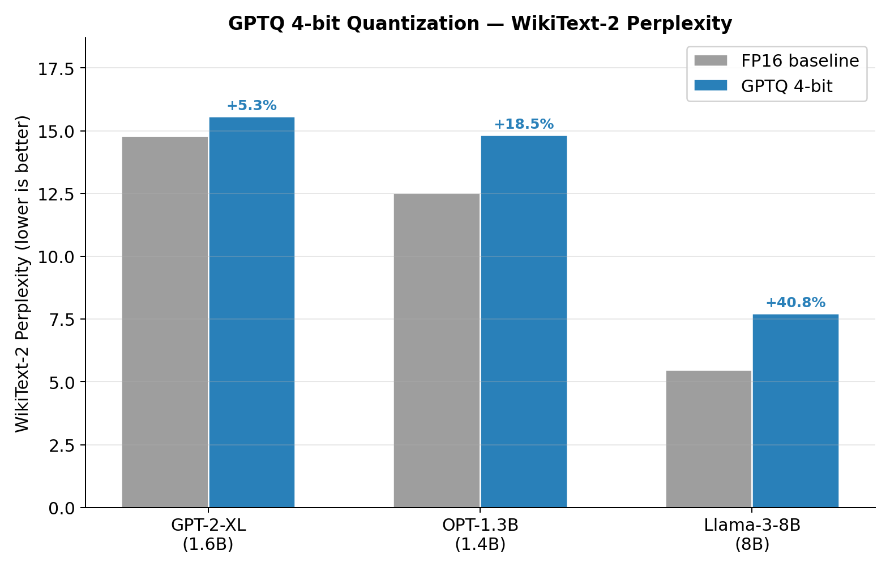
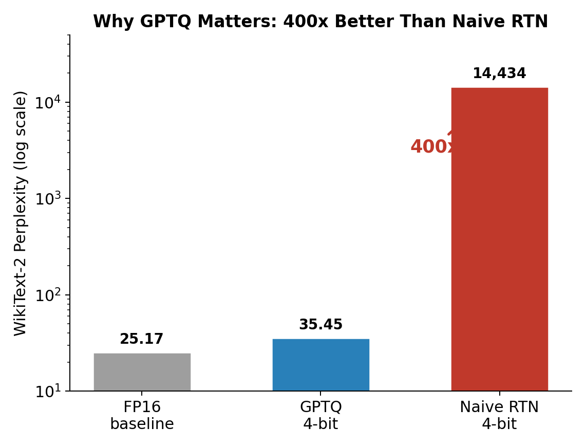
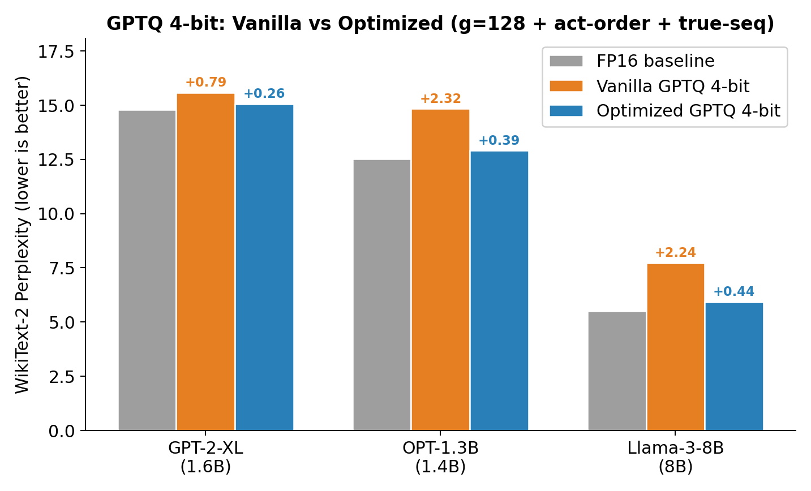
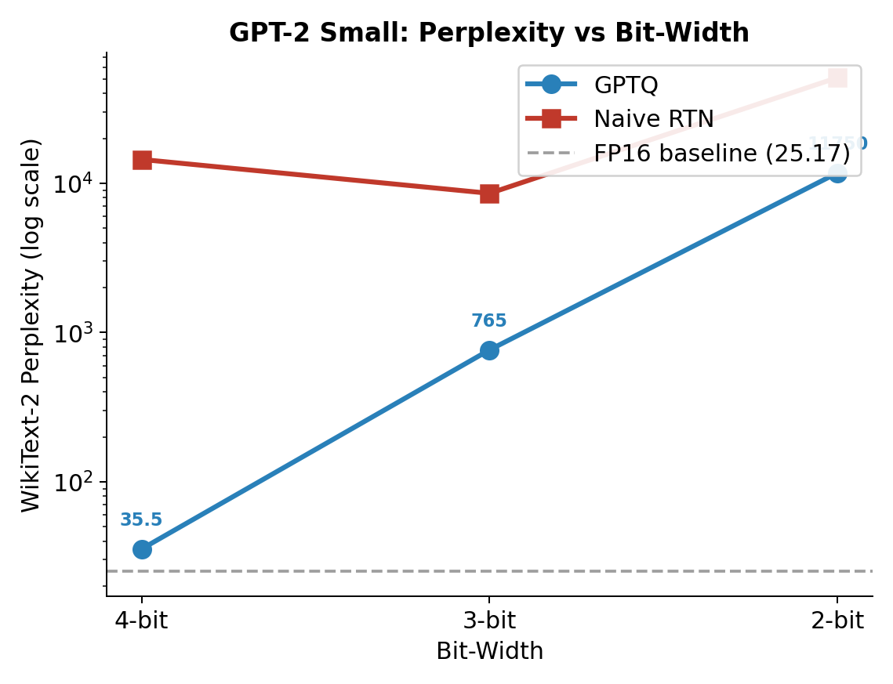
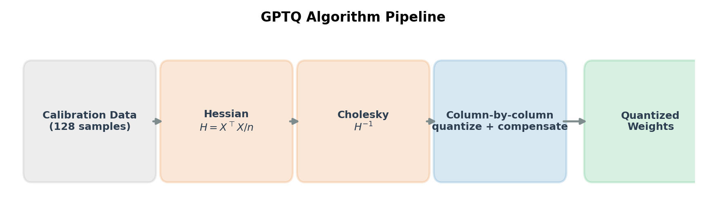

# GPTQ From Scratch

[](https://pytorch.org)
[](LICENSE)
[]()

A clean, from-scratch implementation of the **GPTQ post-training quantization algorithm** ([Frantar et al., 2022](https://arxiv.org/abs/2210.17323)) in PyTorch. No external quantization libraries — every component is written explicitly, from Hessian approximation to Cholesky-based weight updates.

Supports **GPT-2, OPT, and Llama** architectures with automatic detection. Includes three optimization techniques from the paper: grouping, act-order, and true-sequential.

**What I built:**
- Complete GPTQ algorithm from scratch (Hessian, Cholesky inverse, column-wise error compensation)
- Multi-architecture support: GPT-2, OPT, LLaMA with automatic detection
- Three optimization techniques: grouping, act-order, true-sequential (3-6x improvement)
- Benchmarked on 4 models up to Llama-3-8B, matching the original paper's quality

## Table of Contents
- [Results](#results)
- [Background](#background)
- [Implementation Details](#implementation-details)
- [Optimizations](#optimizations)
- [Technical Decisions](#technical-decisions)
- [Usage](#usage)
- [What I Learned](#what-i-learned)
- [Challenges & Solutions](#challenges--solutions)
- [Companion Project](#companion-project)
- [Limitations](#limitations)
- [References](#references)

## Results

### Results — Vanilla GPTQ 4-bit

WikiText-2 perplexity (↓ is better):

| Model | Params | FP16 | GPTQ 4-bit | Delta | Delta % |
|-------|--------|------|------------|-------|---------|
| GPT-2 | 124M | 25.17 | 35.45 | +10.28 | +40.9% |
| GPT-2-XL | 1.6B | 14.79 | 15.58 | +0.79 | +5.3% |
| OPT-1.3B | 1.4B | 12.51 | 14.83 | +2.32 | +18.5% |
| Llama-3-8B | 8B | 5.49 | 7.73 | +2.24 | +40.8% |



Naive RTN on GPT-2: 14,434 PPL (vs 35.45 for GPTQ — 400x gap).



> Larger models quantize better: GPT-2-XL loses only 5.3% at 4-bit. Consistent with findings in Frantar et al. (2022).

### Results — Optimized GPTQ 4-bit (grouping g=128 + act-order + true-sequential)

| Model | Params | FP16 | Vanilla | Optimized | Improvement |
|-------|--------|------|---------|-----------|-------------|
| GPT-2-XL | 1.6B | 14.79 | 15.58 (+0.79) | 15.05 (+0.27) | 3x closer to FP16 |
| OPT-1.3B | 1.4B | 12.51 | 14.83 (+2.32) | 12.90 (+0.39) | 6x closer to FP16 |
| Llama-3-8B | 8B | 5.49 | 7.73 (+2.24) | 5.93 (+0.44) | 5x closer to FP16 |

> With all three optimizations enabled, deltas are comparable to the original paper (e.g., +0.39 on OPT-1.3B vs +0.84 reported by Frantar et al.). Note that baselines differ due to calibration dataset (WikiText-2 vs C4 in the paper). The combined effect of grouping + act-order + true-sequential reduces the gap to FP16 by 3-6x across all models.



### Calibration dataset: WikiText-2 vs C4

WikiText-2 perplexity (↓ is better), evaluated on WikiText-2 test set:

| Model | Params | FP16 | W2 Vanilla | W2 Optimized | C4 Vanilla | C4 Optimized |
|-------|--------|------|------------|--------------|------------|--------------|
| GPT-2-XL | 1.6B | 14.79 | 15.58 (+0.79) | 15.05 (+0.27) | 15.81 (+1.02) | 15.05 (+0.27) |
| OPT-1.3B | 1.4B | 12.51 | 14.83 (+2.32) | 12.90 (+0.39) | 15.14 (+2.63) | 13.04 (+0.53) |
| Llama-3-8B | 8B | 5.49 | 7.73 (+2.24) | 5.93 (+0.44) | 2397.42 (+2391.93) | 8.63 (+3.14) |

> **Same-distribution calibration helps, but optimizations matter more.** WikiText-2 calibration gives a slight edge when evaluating on WikiText-2 (expected — same distribution). But the dramatic finding is Llama-3-8B: vanilla GPTQ with C4 calibration catastrophically fails (2397 PPL), while optimized C4 recovers to 8.63. With optimizations enabled, GPT-2-XL converges to the same result regardless of calibration dataset.

### Extreme quantization on GPT-2 small

| Method | 4-bit | 3-bit | 2-bit |
|:--|--:|--:|--:|
| FP16 baseline | 25.18 | 25.18 | 25.18 |
| **GPTQ** | **34.56** | **765.03** | **11749.80** |
| Naive RTN | 14413.81 | 8559.39 | 51045.48 |

> Below 4-bit, even GPTQ degrades significantly on this 124M-parameter model — a known limitation at extreme compression on small models.



## Background

### The quantization problem

Large language models are expensive to deploy. A 7B-parameter model in FP16 requires 14 GB of memory — quantizing to 4-bit integers cuts this to 3.5 GB, enabling inference on consumer hardware. But naive quantization (round each weight independently) introduces catastrophic error accumulation, especially at low bit-widths.

### Why GPTQ works

GPTQ builds on **Optimal Brain Quantization** (OBQ), which frames weight quantization as a layer-wise optimization problem. Given a weight matrix $W$ and the Hessian of the layer's reconstruction loss $H = X^\top X$, GPTQ finds quantized weights $\hat{W}$ that minimize:

$$\|WX - \hat{W}X\|_2^2 = (w - \hat{w})^\top H (w - \hat{w})$$

The key idea: when you quantize column $j$, you can **compensate** by adjusting all remaining unquantized columns using the inverse Hessian. This propagates the quantization error optimally across the weight matrix rather than letting it accumulate.

### Algorithm (simplified)



```
for each column block B:
    for each column j in B:
        1. Quantize: q_j = round(w_j / scale) * scale
        2. Compute error: δ = (w_j - q_j) / [H⁻¹]_jj
        3. Update remaining columns: W[:, j+1:] -= δ · [H⁻¹]_j,j+1:
    Lazy batch update: W[:, after B] -= Errors @ H⁻¹[B, after B]
```

Three insights make this practical at scale:
1. **Hessian approximation**: $H \approx X^\top X / n$ from calibration data (128 samples)
2. **Cholesky inversion**: Pre-compute $H^{-1}$ via Cholesky decomposition once per layer
3. **Block processing**: Process columns in blocks of 128, applying lazy batch updates — this enables efficient matrix operations while maintaining the column-by-column error compensation

## Implementation details

### Multi-architecture support

Supports GPT-2 (Conv1D layers), OPT (Linear layers), and LLaMA (GQA + RoPE). Architecture-specific logic is isolated in `arch_config.py`. Adding a new architecture requires implementing 5 functions: `get_blocks`, `get_layers`, `get_block_kwargs`, `get_max_seq_len`, `get_embed_fn`.

### Architecture

```
main.py          Entry point, CLI, W&B logging
arch_config.py   Auto-detection and per-architecture accessors (GPT-2, LLaMA, OPT)
gptq.py          Core GPTQ: Hessian, Cholesky inverse, block-wise quantization
quantize.py      Symmetric uniform quantization (per-row and per-group scales)
model_utils.py   Model loading, calibration data, block-wise processing
evaluate.py      WikiText-2 perplexity (sliding window)
```

### Block-by-block calibration

A naive approach would run calibration data through the full model for each layer — $O(L \times N)$ full forward passes. Instead, we propagate hidden states **block by block** through the transformer blocks:

```
Calibration data → Embeddings → Block 0 → Block 1 → ... → Block N
                                  ↓          ↓                ↓
                               Quantize   Quantize         Quantize
```

For each block:
1. Register forward hooks on all Linear/Conv1D layers
2. Run hidden states through the block → accumulate Hessians directly in hooks ($H += X^\top X$)
3. Run GPTQ on each layer using the accumulated Hessian
4. Propagate hidden states through the **quantized** block → inputs for next block

Hidden states are offloaded to CPU between blocks, keeping GPU memory usage constant regardless of calibration set size.

### Quantization scheme

- **Symmetric uniform** quantization: $q = \text{clamp}(\text{round}(w / s),\ -2^{b-1},\ 2^{b-1}-1)$
- **Per-row scales** (per output channel): $s_i = \max_j |W_{ij}| / (2^{b-1} - 1)$
- Scales are computed once from the original weights and held fixed during GPTQ column updates
- Handles HuggingFace GPT-2's `Conv1D` layers (weight shape transposed vs `nn.Linear`)

### Numerical stability

- Damped Hessian: $H \leftarrow H + \lambda I$ with $\lambda = 0.01 \cdot \text{mean}(\text{diag}(H))$
- Cholesky fallback: if decomposition fails, add extra damping ($10\%$ of diagonal mean) and retry

### Optimizations

Three techniques from the GPTQ paper and follow-up work, enabled via CLI flags:

**Grouping** (`--group-size 128`): Instead of one scale per row, compute independent scale/zero-point per group of 128 consecutive columns. Finer granularity reduces quantization error at the cost of storing more scale factors.

**Act-order** (`--act-order`): Quantize columns in order of decreasing activation magnitude (diag(H)). Columns with the highest impact are quantized first, when accumulated error is still low. Later columns absorb more error but matter less.

**True-sequential** (`--true-sequential`): Within each transformer block, quantize sub-layers sequentially (Q,K,V → O → fc1 → fc2), re-propagating activations between each group. This ensures each sub-layer sees the actual quantized outputs of the previous one, rather than stale full-precision activations.

Use `--all-tricks` to enable all three simultaneously.

### Technical Decisions

#### Why symmetric quantization (not asymmetric)
| Method | Verdict | Rationale |
|--------|---------|-----------|
| Asymmetric (scale + zero-point) | Rejected | Adds complexity, minimal benefit for weight-only quantization where distributions are roughly symmetric |
| Symmetric (scale only) | **Adopted** | Simpler, faster, matches the original paper's approach |

#### Why block-by-block (not layer-by-layer)
| Method | Verdict | Rationale |
|--------|---------|-----------|
| Full model forward per layer | Rejected | O(L × N) forward passes, intractable for 8B models |
| Block-by-block with CPU offload | **Adopted** | Constant GPU memory, scales to any model size |

#### Why WikiText-2 calibration (not C4)
| Method | Verdict | Rationale |
|--------|---------|-----------|
| C4 (paper default) | Available via --calib-dataset c4 | Matches paper setup, but slower to load. Vanilla C4 catastrophically fails on Llama-3-8B (2397 PPL) |
| WikiText-2 (our default) | **Default** | Same-distribution advantage when evaluating on WikiText-2. With optimizations, both converge (e.g., GPT-2-XL: identical 15.05 PPL) |

## Usage

```bash
# Setup
pip install -r requirements.txt

# FP16 baseline
python main.py --baseline

# GPTQ quantization (4/3/2-bit)
python main.py --quantize --bits 4
python main.py --quantize --bits 3
python main.py --quantize --bits 2

# Naive round-to-nearest (for comparison)
python main.py --quantize --bits 4 --naive

# Multi-model benchmark
python main.py --model gpt2-xl --quantize --bits 4
python main.py --model facebook/opt-1.3b --quantize --bits 4
python main.py --model meta-llama/Meta-Llama-3-8B --quantize --bits 4 --token YOUR_HF_TOKEN

# With optimizations
python main.py --model facebook/opt-1.3b --quantize --bits 4 --all-tricks
python main.py --model facebook/opt-1.3b --quantize --bits 4 --group-size 128 --act-order

# With W&B logging
python main.py --wandb --quantize --bits 4

# All options
python main.py --model gpt2 --device cpu --quantize --bits 4 \
    --n-samples 128 --block-size 128 --stride 512 \
    --group-size 128 --act-order --true-sequential
```

## What I Learned

- **Hessian quality matters enormously at 4-bit**: GPTQ 4-bit (34.56 ppl) vs RTN 4-bit (14413 ppl) — a 400x gap. Error compensation is the difference between a usable model and garbage.
- **Block-wise processing is essential**: The original per-layer calibration approach was intractable on CPU. Restructuring to block-by-block propagation cut runtime from hours to minutes.
- **Conv1D vs Linear**: HuggingFace GPT-2 uses `Conv1D` (weight shape `(in, out)`) instead of `nn.Linear` (weight shape `(out, in)`). This subtle transposition must be handled consistently across Hessian computation, GPTQ updates, and weight write-back.
- **Architecture-specific quirks**: Llama requires explicit `position_embeddings=(cos, sin)` in transformers ≥ 4.44, and its decoder blocks return tensors (not tuples). Memory management via Hessian accumulation in hooks and CPU offloading is critical for 8B+ models on 40 GB GPUs.
- **Optimizations compound**: Grouping (g=128) alone helps, but act-order + true-sequential together reduce the delta by 3-6x. On OPT-1.3B, vanilla GPTQ loses +2.32 PPL; with all tricks, only +0.39 — matching the quality of the original paper's implementation.

## Companion Project

See [Does Quantization Kill Interpretability?](https://github.com/lciric/does-quantization-kill-interpretability) — a mechanistic interpretability analysis showing how quantization affects internal circuits across 5 models (124M–2.8B). GPTQ preserves 100% of induction heads; naive RTN destroys them in small models.

## Challenges & Solutions

| Problem | Investigation | Solution |
|---------|--------------|---------|
| Conv1D weight transposition | GPT-2 uses Conv1D (in, out) not Linear (out, in) — Hessian rows/cols were swapped | Detect Conv1D at hook time, transpose before Hessian accumulation and after weight write-back |
| Llama rotary embeddings | transformers >= 4.44 removed deprecated fallback in LlamaDecoderLayer.forward() | Pre-compute (cos, sin) from model.model.rotary_emb and pass as position_embeddings kwarg |
| Llama GQA shape mismatch | "size of tensor a (32) must match size of tensor b (128)" — 32 Q heads vs 8 KV heads | Ensure attention_mask shape is (batch, 1, seq, seq) not (batch, n_heads, seq, seq) |
| OPT-1.3B high delta (+2.32) | Vanilla GPTQ with per-row scales too coarse for OPT's weight distribution | Grouping g=128 + act-order reduced delta to +0.39 (6x improvement) |
| Llama-3-8B OOM on A100 40GB | 16GB model + GPTQ Hessians exceeded 40GB | Reduced calibration samples to 64, accumulated Hessians in hooks (no storage of full activations) |
| Cholesky decomposition failure | Hessian near-singular on some layers | Added damping λ = 0.01 × mean(diag(H)) + fallback with 10% extra damping |

## Limitations

1. **WikiText-2 calibration bias**: Default calibration uses same dataset as evaluation — deltas are slightly optimistic vs C4 calibration (e.g., OPT-1.3B: +0.39 W2 vs +0.53 C4 optimized). With optimizations enabled, the gap narrows significantly
2. **No weight grouping storage**: Quantized weights are dequantized back to FP16 — no actual memory savings at inference
3. **Single seed**: Results shown from single runs, no confidence intervals
4. **No kernel implementation**: Pure PyTorch, no custom CUDA kernels for actual 4-bit inference speedup

## References

- Frantar, E., Ashkboos, S., Hoefler, T., & Alistarh, D. (2022). [GPTQ: Accurate Post-Training Quantization for Generative Pre-trained Transformers](https://arxiv.org/abs/2210.17323). *ICLR 2023*.
- Frantar, E., & Alistarh, D. (2022). [Optimal Brain Compression: A Framework for Accurate Post-Training Quantization and Pruning](https://arxiv.org/abs/2208.11580). *NeurIPS 2022*.
- Hassibi, B., & Stork, D. (1992). Second order derivatives for network pruning: Optimal Brain Surgeon. *NeurIPS 1992*.
